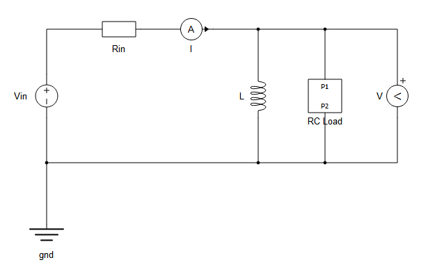

# 3. Schematic Editor API

Module: `TyphoonHilApi.Communication.APIs.SchematicAPI`

The Schematic API provides a set of functions/methods to manipulate existing schematic models (tse files) and create new ones programmatically. It is commonly used for creating scripts to automate repetitive tasks and for testing purposes.

## 3.1 Examples

### 3.1.1 Example 1

This example illustrates creating a model from scratch, saving it, and compiling it as the final step.

```csharp
using System;
using Newtonsoft.Json.Linq;

class Program
{
    static void Main(string[] args)
    {
        string path = "C:\\Users\\Dell\\source\\repos\\TyphoonHilApi\\TestData\\";

        // Create SchematicAPI object
        SchematicAPI model = new();

        // ... (rest of the code)

        // Set component parameters
        Console.WriteLine("Setting component properties...");
        model.SetPropertyValue(model.Prop(rIn, "resistance"), rInValue);
        model.SetPropertyValue(model.Prop(ind, "inductance"), lValue);
        model.SetPropertyValue(model.Prop(r, "resistance"), rValue);
        model.SetPropertyValue(model.Prop(c, "capacitance"), cValue);

        // Save the model
        string fileName = path + "RLC_example.tse";
        Console.WriteLine($"Saving model to '{fileName}'...");
        model.SaveAs(fileName);

        // Compile model
        if (model.Compile())
            Console.WriteLine("Model successfully compiled.");
        else
            Console.WriteLine("Model failed to compile");

        // Close the model
        model.CloseModel();
    }
}
```
Script output:
```csharp
Creating scheme items...
Connecting components...
Setting component properties...
Saving model to 'Given-Path\RLC_example.tse'...
Model successfully compiled.
```

After executing this script, the model is saved in a file named `RLC_example.tse` in directory given in the code. Following image shows how model looks like if opened in Typhoon Schematic Editor.


